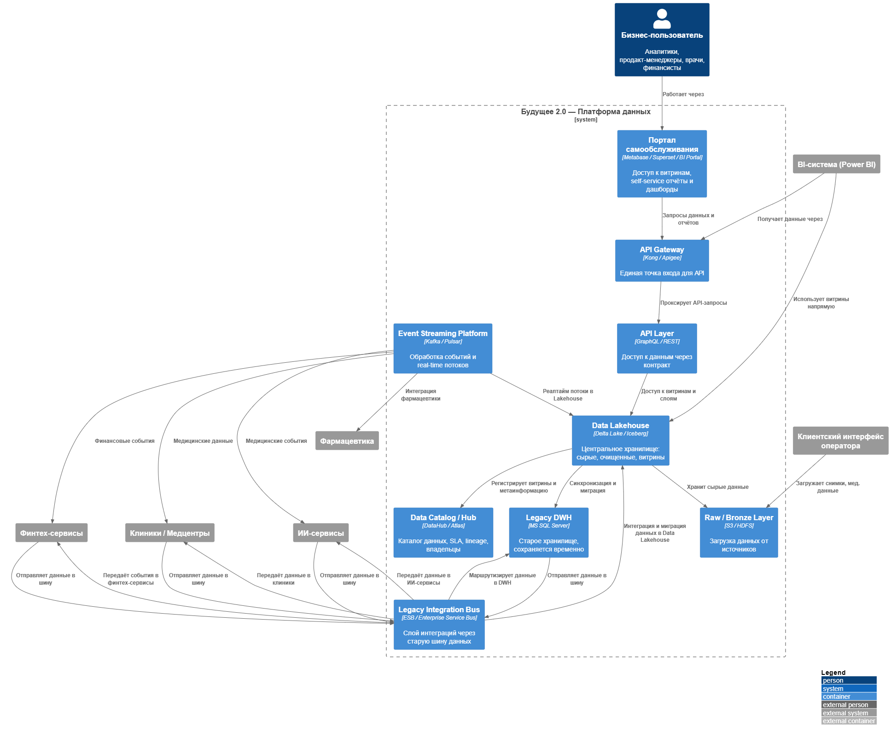

# 📘 Задание 1

## ✅ Диаграмма контейнеров

- 📎 [PlantUML-диаграмма](./с4_container_to_be.puml)
- 🖼️ 

---

# 📊 Задание 2. Анализ проблемных мест

| №   | Проблема                                                  | Описание                                                                                                      | Последствия для бизнеса                                                                             |
| --- | --------------------------------------------------------- | ------------------------------------------------------------------------------------------------------------- | --------------------------------------------------------------------------------------------------- |
| 1   | **Устаревший монолитный DWH (MS SQL Server 2008)**        | Используется как источник данных, процессор логики, интерфейс и интеграционная точка.                         | Ограничения в масштабируемости, высокая стоимость владения, сложность добавления новых доменов.     |
| 2   | **Отсутствие Data Lake / Data Lakehouse**                 | Нет слоя, где можно хранить полу- или неструктурированные данные: мед. изображения, логи устройств, стриминг. | Нет возможности собирать и обрабатывать большие объёмы разнообразных данных.                        |
| 3   | **Отсутствие Data Hub / Каталога данных**                 | Нет системного управления метаданными: lineage, владельцы, SLA, описания.                                     | Потеря доверия к данным, высокая стоимость аналитики, риски несоответствия требованиям регуляторов. |
| 4   | **Power BI привязан к DWH напрямую**                      | Нет промежуточного слоя витрин. Все запросы идут в DWH.                                                       | Медленные отчёты, дублирование логики, невозможность real self-service.                             |
| 5   | **Смешанные медицинские и бизнес-данные**                 | Хранятся и обрабатываются в одной среде.                                                                      | Юридические и комплаенс-риски, невозможность изолировать домены.                                    |
| 6   | **Нет событийной архитектуры**                            | Вся передача данных — через ETL и батчи.                                                                      | Высокая задержка, сложно построить real-time витрины и автоматические реакции.                      |
| 7   | **Технический долг в интеграционной шине (Apache Camel)** | Шина устарела, плохо масштабируется, сложно добавлять новых провайдеров.                                      | Замедление time-to-market при подключении новых бизнесов (фарма, электроника).                      |

---

# 📌 Задание 3. Приоритизация проблем

## ✅ Метод MoSCoW

| Приоритет               | Проблема                               | Почему                                                                                                                |
| ----------------------- | -------------------------------------- | --------------------------------------------------------------------------------------------------------------------- |
| **Must (Обязательно)**  | 1. Устаревший DWH                      | Это узкое горлышко: не масштабируется, не делится по доменам. Без его устранения невозможно развивать BI, финтех, ИИ. |
| **Must (Обязательно)**  | 2. Нет Data Lakehouse / Data Lake      | Без Lakehouse нельзя масштабировать данные: нужны сырые слои, витрины, хранение образов, стриминг.                    |
| **Must (Обязательно)**  | 3. Отсутствие Data Hub                 | Каталог, SLA, доступы, lineage — всё зависит от наличия централизованного управления данными.                         |
| **Should (Желательно)** | 4. Power BI напрямую подключен к DWH   | BI надо отвязать от DWH и подключить к витринам в Lakehouse.                                                          |
| **Should (Желательно)** | 5. Нет событийной архитектуры          | Kafka/EventBus нужны для real-time обработки в финтехе и ИИ.                                                          |
| **Could (Можно)**       | 6. Смешанные медицинские и фин. данные | Можно изолировать зоны хранения и разграничить доступ.                                                                |
| **Could (Можно)**       | 7. Интеграционная шина устарела        | Постепенный переход на EventMesh/Kafka с новых систем.                                                                |

---

## ✅ Матрица Эйзенхауэра

### 🟥 Важно / Срочно

| Приоритет | Действие                                                                       |
| --------- | ------------------------------------------------------------------------------ |
| ✅        | Проектирование core архитектуры: Lakehouse, Event Bus, API Gateway             |
| ✅        | План миграции с Legacy DWH                                                     |
| ✅        | Развёртывание self-service BI портала: Superset / Metabase / Power BI Embedded |

---

### 🟨 Важно / Не срочно

| Приоритет | Действие                                                                                      |
| --------- | --------------------------------------------------------------------------------------------- |
| 🧠        | Внедрение DataHub / Apache Atlas (каталог, SLA, lineage)                                      |
| 🧠        | Формализация владения данными (Data Ownership) и распределение ответственности между доменами |
| 🧠        | Создание и поддержка API-контрактов                                                           |
| 🧠        | Обучение команд работе с новой архитектурой и onboarding                                      |

---

### 🟦 Не важно / Срочно

| Приоритет | Действие                                                               |
| --------- | ---------------------------------------------------------------------- |
| ⚙️        | Поддержка интеграции через старую шину Apache Camel (legacy ESB)       |
| ⚙️        | Поддержка старых кастомных скриптов и выгрузок из MS SQL по требованию |

---

### ⬜ Не важно / Не срочно

| Приоритет | Действие                                                              |
| --------- | --------------------------------------------------------------------- |
| 💤        | Автоматизация SLA мониторинга витрин (отложить до зрелости процессов) |
| 💤        | Обновление UI устаревших систем (например, на Power Builder)          |
| 💤        | Развитие старых витрин в DWH, не включённых в архитектуру 2.0         |

---

> 💡 _Рекомендация:_ Используйте эту матрицу для планирования релизов и коммуникации с бизнесом. То, что попадает в квадрант "Важно / Срочно", должно быть реализовано в течение ближайших 2 спринтов.
