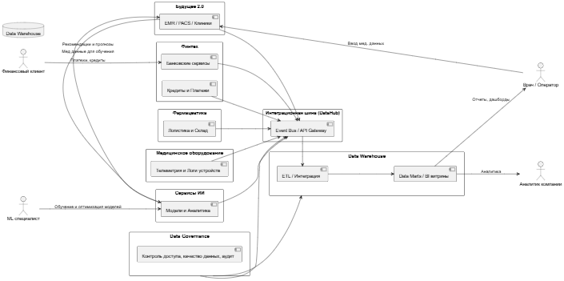
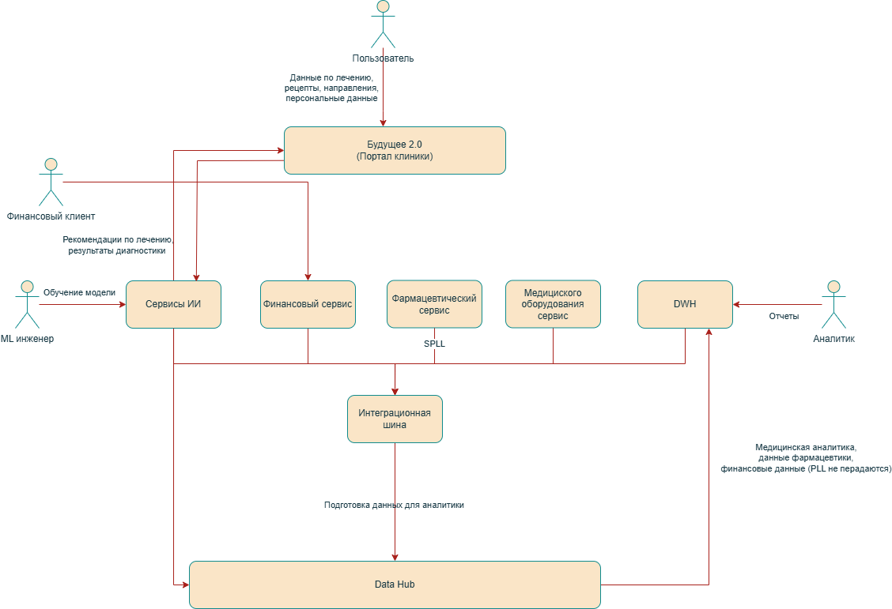

# 📘 Задание 2

## 🧱 Предложенное доменное разделение

| №   | Домен                           | Назначение                                                    |
| --- | ------------------------------- | ------------------------------------------------------------- |
| 1   | Будущее 2.0 (Медицинский домен) | Медкарты, EMR, PACS, клиники, управление пациентами           |
| 2   | Финтех                          | Банковские сервисы, кредиты, платёжная история                |
| 3   | Фармацевтика                    | Поставки, склад, логистика, фармсети                          |
| 4   | Медицинское оборудование        | Телеметрия, логи с медицинских устройств                      |
| 5   | Сервисы ИИ                      | Модели машинного обучения, аналитика, предсказания            |
| 6   | Data Warehouse                  | Централизованное хранилище данных, интеграция, аналитика, ETL |

---

## 🔄 Потоки данных между доменами (Data Flow Diagram)

[DFD диаграмма Puml](dfd.puml)

[DFD диаграмма Drawio](./dfd.drawio)

---

## 🔄 Логика разделения на домены

- **Будущее 2.0** — ядро медицинской системы, где хранится и обрабатывается основная информация о пациентах и клиниках.
- **Финтех** — отдельный финансовый домен, обеспечивающий банковские услуги, кредитование и платежи.
- **Фармацевтика** — логистика и учёт лекарств, связь с фармкомпаниями.
- **Медицинское оборудование** — домен для сбора и обработки телеметрии и логов с приборов.
- **Сервисы ИИ** — отдельный домен для моделей машинного обучения и аналитики, взаимодействующий с медицинским доменом и Data Warehouse.
- **Data Warehouse** — единая точка сбора, хранения и анализа данных из всех доменов, обеспечивающая бизнес-аналитику и отчёты.

---

## 🚀 Преимущества для компании

- **Ускорение разработки** — команды работают автономно по своим доменам без частых междоменных согласований.
- **Повышение качества данных** — Data Warehouse обеспечивает единый источник истины и контроль качества.
- **Гибкость и масштабируемость** — возможность легко добавлять новые функции и расширять домены.
- **Чёткое разделение ответственности** — проще управлять и поддерживать системы.
- **Оптимизация аналитики** — централизованная агрегация данных для BI и отчетности.

---
