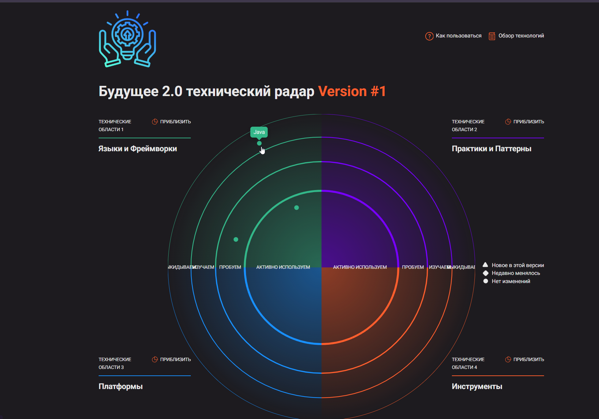
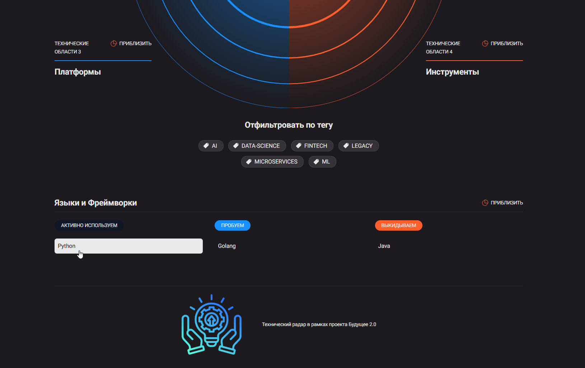
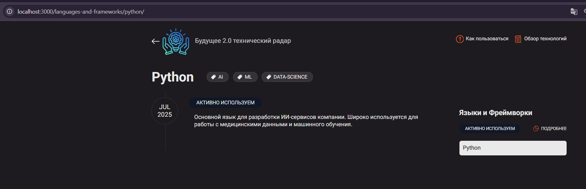
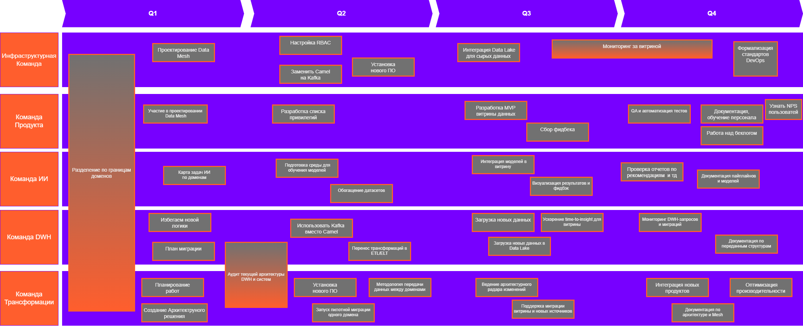

# 📘 Задание 3 — Архитектурная трансформация компании «Будущее 2.0»

## 📡 Технический радар

| 🟢 Adopt (Рекомендуем к использованию)       | 🟡 Trial (Пилотируем)                      | 🟠 Assess (Оцениваем)                   | 🔴 Hold (Устаревшее / Подлежит замене)       |
| -------------------------------------------- | ------------------------------------------ | --------------------------------------- | -------------------------------------------- |
| **Power BI** — основной инструмент аналитики | **Golang** — для новых финтех-сервисов     | **Snowflake** — облачное DWH            | **MS SQL Server 2008** — устаревший DWH      |
| **Python** — для разработки ИИ и ML          | **Kafka** — современная шина данных        | **Data Mesh** — архитектурная стратегия | **Apache Camel** — старая шина интеграции    |
| **Modern BI Tools** — витрина данных         | **Data Lake** — хранилище для сырых данных | **Microservices** — новая парадигма     | **Power Builder** — устаревший UI            |
| **API Gateway** — единый доступ к данным     | **Kubernetes** — оркестрация сервисов      | **GraphQL** — гибкий API-доступ         | **Java Legacy** — старый код финтех-сервисов |
| **Airflow** — оркестрация ETL                | **dbt** — трансформации в DWH              | **Spark** — обработка больших данных    | **Монолитное DWH** — текущая архитектура     |

---

## 📘 Пояснения к техрадару

- **Adopt** — проверенные технологии, рекомендованные к широкому применению.
- **Trial** — решения в стадии активного пилотирования.
- **Assess** — технологии на этапе оценки потенциала и возможностей.
- **Hold** — устаревшие решения, от которых планируется отказаться.

---

## 📌 Рекомендации

- Продолжать стандартизацию и масштабирование технологий из сегмента **Adopt**.
- Расширять экспертизу по технологиям из **Trial** и проводить пилотные кейсы.
- Аккуратно тестировать перспективные подходы из **Assess**.
- Планировать последовательную замену всех решений из **Hold**.

---

## 📊 Визуализация технического радара

> _(Примеры размещены локально или на Wiki-портале команды)_

---

## 🛣️ Roadmap трансформации

📂 [Файл Roadmap в Draw.io](./roadmap.drawio)  
🖼️ 

---

## ✅ Команда Продукта

### Q1

- **Разделение по границам доменов** — для автономности команд.
- **Участие в проектировании Data Mesh** — поддержка масштабируемой архитектуры.
- **Сбор требований к витрине данных** — на основе бизнес-потребностей.

### Q2

- **Настройка RBAC** — контроль доступа по ролям.
- **Разработка ключевых пользовательских сценариев** — для релевантности MVP.

### Q3

- **Разработка MVP витрины** — первая версия портала самообслуживания.
- **Расширение функциональности витрины** — фильтры, графики, отчёты.
- **Валидация бизнес-метрик** — проверка корректности показателей.
- **Сбор фидбэка от пользователей** — для улучшения UX.

### Q4

- **QA и автоматизация тестов** — обеспечение надёжности.
- **Документация и обучение пользователей** — снижение нагрузки на поддержку.
- **Планирование следующей версии** — развитие на основе обратной связи.

---

## ✅ Команда ИИ

### Q1

- **Разделение по доменам** — определение применимости ИИ.
- **Каталог доступных датасетов** — инвентаризация источников данных.
- **Участие в проектировании архитектуры** — интеграция моделей в экосистему.

### Q2

- **Подготовка среды для обучения моделей** — отделение от прод-среды.
- **Определение приоритетных ML-кейсов** — фокус на бизнес-ценность.
- **Сбор и очистка данных** — подготовка пайплайнов.

### Q3

- **Обучение и валидация моделей** — запуск первых ИИ-сервисов.
- **Интеграция с витриной данных** — визуализация предсказаний.
- **Сбор обратной связи от бизнес-пользователей** — для корректировки моделей.

### Q4

- **Оценка полезности моделей** — через метрики и impact.
- **Документация пайплайнов и моделей** — стандарты и повторяемость.
- **Подготовка к масштабированию на другие домены** — перенос успешных решений.

---

## ✅ Команда DWH

### Q1

- **Аудит существующего DWH** — анализ текущей структуры и логики.
- **Привязка сущностей к доменам** — переход к Data Mesh.
- **План миграции бизнес-логики** — roadmap отказа от монолита.

### Q2

- **Переход с Camel на Kafka** — новый слой передачи данных.
- **Вынос логики из DWH** — снижение зависимости от SQL Server.
- **Поддержка витрины данных** — выгрузки и агрегаты.

### Q3

- **Загрузка данных в Data Lake** — создание единого хранилища.
- **Миграция критичных таблиц** — оптимизация нагрузки на SQL Server.
- **Оптимизация запросов** — улучшение time-to-insight.

### Q4

- **Мониторинг качества миграций** — выявление узких мест.
- **Документация DWH-структур** — помощь другим командам.
- **Управление остатками** — минимизация поддержки монолита.

---

## ✅ Инфраструктурная команда

### Q1

- **Аудит текущей инфраструктуры** — выявление устаревших компонентов.
- **Выбор целевых технологий** — Kafka, Data Lake, Kubernetes, Vault и др.
- **Проектирование облачной среды** — изоляция, зоны доступа, Dev/Test/Prod.

### Q2

- **Развёртывание Kafka и Data Lake** — инфраструктура для хранения и стриминга.
- **Настройка IAM, RBAC и VPN** — безопасный доступ к системам.
- **Развёртывание среды для ETL/ML** — Airflow, MLflow, Prefect.

### Q3

- **CI/CD пайплайны для всех команд** — GitOps и шаблоны развертывания.
- **Мониторинг и логирование** — Prometheus + Grafana, Opensearch.
- **Оптимизация производительности** — настройка SLA, autoscaling, HA.

### Q4

- **Документация инфраструктурных решений** — Helm, Terraform, CI/CD шаблоны.
- **Поддержка интеграции новых бизнесов** — масштабирование платформы.
- **Формализация стандартов DevOps** — чек-листы и гайды.

---

## ✅ Команда Трансформации

### Q1

- **Разработка архитектурного решения** — единая картина будущей системы.
- **Определение границ доменов** — для построения Data Mesh.
- **Создание план-графика трансформации** — управление проектом и зависимостями.

### Q2

- **Выбор технологических стандартов Data Mesh** — единый стек и подход.
- **Пилотная миграция одного домена** — тест концепции.
- **Разработка методологии передачи данных** — подходы, стандарты, безопасность.

### Q3

- **Координация масштабирования** — архитектурные ревью и синки.
- **Архитектурный радар** — контроль за внедрением новых решений.
- **Поддержка внедрения витрины и новых источников** — сопровождение ключевых компонентов.

### Q4

- **Финализация документации по архитектуре** — переход к BAU-процессам.
- **Оценка зрелости доменов** — готовность к независимой работе.
- **Интеграция новых бизнесов** — проверка гибкости архитектуры на реальных кейсах.

---

## 🧠 Обоснование общего подхода

- 🧩 **Data Mesh и доменная архитектура** — независимость и масштабируемость.
- 🏗️ **Вынос логики из монолита** — упрощение сопровождения и адаптации.
- 📊 **Витрина данных** — единая точка доступа для бизнес-анализа.
- 👷 **Сильная архитектурная команда** — удержание целостности подхода.
- 🤝 **Скоординированная работа всех команд** — минимизация технического и организационного долга.

---
